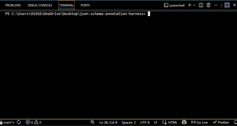
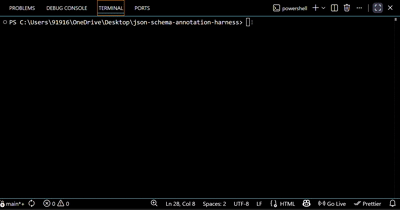


# Hyperjump results

---

## Results

✅ **217 passed**   ·   ❌ **0 failed**   ·   ⏭ **124 skipped**   ·   **0.00% failure rate**

**Failure rate:** 0.00%  
Skipped tests are filtered by the `compatibility` field – they don't apply to the draft.

[FULL REPORT](https://drive.google.com/file/d/1qKpRl-7gOAPm2GGMC3OgteJq4nc2mAFF/view?usp=drivesdk)

---

## Before / After – PR #862

When I started writing the harness, I spent a lot of time reading the annotation test files to understand their structure. That’s when I noticed something : `$dynamicRef` and `$dynamicAnchor` – two keywords introduced in 2020‑12 with defined annotation behaviour – had no annotation tests at all in `core.json`.

I filed [Issue #861](https://github.com/json-schema-org/JSON-Schema-Test-Suite/issues/861) to track the gap. The mentor assigned it to me, and I added the missing tests in [PR #862](https://github.com/json-schema-org/JSON-Schema-Test-Suite/pull/862) (merged). The harness was already running, so I could verify the difference:

Before PR- 214 PASSES
After PR - 217 PASSES

## Before PR- 214 PASSES

 

## After PR- 217 PASSES

 

**That jump of +3 passes is exactly the three new test suites the PR added – proof that the harness works and that the missing coverage is now fixed.**

---

## Library

**`@hyperjump/json-schema`**  
It supports all five drafts and has complete annotation support.  

---

## Highlights

- Supports **all 5 drafts** (04, 06, 07, 2019-09, 2020-12)
- Respects `compatibility` field (including `>=6,<2020` syntax)

---

## Compatibility syntax

| Syntax | Meaning |
|--------|---------|
| `"4"` | Draft 4 and above |
| `"<=7"` | Draft 7 and below |
| `"=2019"` | only 2019‑09 |
| `"2019"` | 2019‑09 and above |
| `"6,<=2019"` | Draft 6 through 2019‑09 |

---

